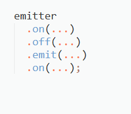
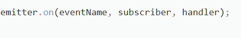
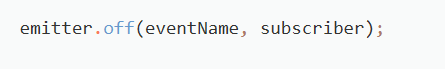
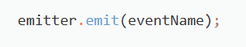

**Лабораторная работа №11**
## **Задание 1.** **Подписка на события**

В этом задании необходимо реализовать библиотеку, позволяющую подписываться на события и получать по ним уведомления.

В библиотеке нужно реализовать три метода:

- **on** *—* подписка на событие;
- **off** *—* отписка от события;
- **emit** *—* оповещение всех подписчиков.

## **Условия**
- Все функции будут вызываться корректно, дополнительных проверок не требуется.
- Все функции должны возвращать объект, от которого вызваны (emitter), чтобы их можно было вызывать в цепочке (chaining):

### **Метод 'on'**
Подписывает на событие. На любое событие подписчик может подписаться неограниченное количество раз.

- eventName *—* название события, на которое подписываемся.
- subscriber *—* объект-подписчик.
- handler *—* функция-обработчик.
### **Метод 'off'**
Отписывает от события подписчика. После отписки, при возникновении данного события, никаких обработчиков, связанных с этим подписчиком, не должно быть вызвано. Есть возможность повторно подписаться и снова получать события.

- eventName *—* название события, от которого отписываемся.
- subscriber *—* объект-подписчик.
### **Метод 'emit'**
Оповещение всех подписчиков (не отписавшихся). Вызывает все функции-обработчики в порядке подписки.

- eventName *—* название события, о котором оповещаем подписчиков.

