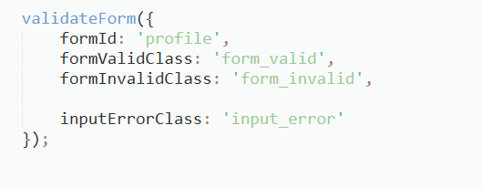
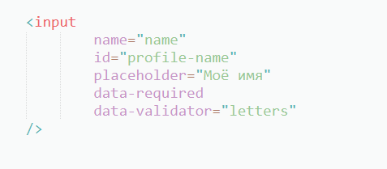

**Лабораторная работа №12**

**Задание 1.** **Проверка формы**

В этой задаче необходимо написать функцию, которая проверяет правильность заполнения формы.

Функция называется validateForm и принимает следующие настройки:

- formId – идентификатор формы;
- formValidClass – класс, добавляемый форме в случае пройденной проверки;
- formInvalidClass – класс, добавляемый форме в случае ошибок;
- inputErrorClass – класс, добавляемый элементам input в случае ошибочного заполнения.

Пример вызова:

В папке– три файла:

- в файлах index.html и index.css реализован пример формы;
- в файле script.js нужно разместить код функции и отправить его на проверку.

**Поведение функции**

После вызова функция отслеживает события на форме и её элементах, то есть вызывает проверки:

- При потере фокуса (blur) элемента input вызывается проверка для этого элемента.
- При отправке формы (submit) проверяются все элементы. Обратите внимание, что форму можно отправить несколькими способами: нажатием enter на элементе input и кликом.
- Фактической отправки происходить не должно. Страница не должна перезагружаться.
- Если элемент не прошел проверку, на него добавляется класс из настройки inputErrorClass.
- Класс с ошибкой (inputErrorClass) удаляется при фокусе на элемент (focus).
- Если при отправке формы нет ошибок, форме добавляется класс из настройки formValidClass: автоматически появляется сообщение, что форма не содержит ошибок.
- Если при отправке формы обнаружены ошибки, в форму добавляется класс из настройки formInvalidClass: автоматически появится сообщение, что форма содержит ошибки.
- Одновременно двух сообщений быть не должно.

**Проверки элементов**

Проверки для конкретного элемента input хранятся в data-атрибутах. Может быть два вида проверки: проверка обязательности заполнения поля и проверка значения по правилу. На одном элементе может быть как и несколько типов проверки, так и ни одной.

Пример:

***Обязательность поля***

Регулируется через атрибут data-required. Наличие этого атрибута означает, что поле обязательно к заполнению.

***Валидация***

Регулируется через атрибуты data-validator (тип валидатора) и data-validator-\* (настройки валидатора). Поддерживается три типа валидатора: letters, number, regexp. Одновременно возможен только один тип.

*Валидатор letters*

Проверяет, что поле содержит только буквы русского и английского алфавита. Настроек не имеет.

*Валидатор numbers*

Проверяет, что поле содержит число. Имеет следующие настройки:

- data-validator-min – минимально возможное число, необязательная настройка;
- data-validator-max – максимально возможное число, необязательная настройка.

*Валидатор regexp*

Проверяет соответствие регулярному выражению. Всегда имеет обязательную настройку data-validator-pattern, содержащую регулярное выражение.

**Обязательные требования**

- Отслеживать события нужно только на форме и внутри. Никакой реакции на input вне формы быть не должно.
- Работать с data-атрибутами нужно через свойство dataset.
- Добавлять/удалять классы нужно через свойство classList.
- В глобальной области видимости (window) не должно появится ничего кроме функции validateForm.
- В HTML и CSS файлых приведён пример формы. Форма может быть другой, задачу необходимо решить в общем случае. Но менять HTML и CSS файлы запрещено.

