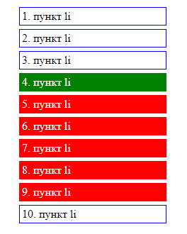
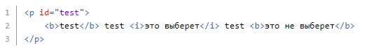
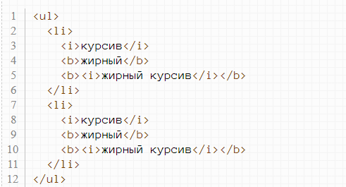
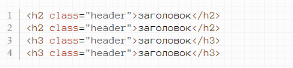
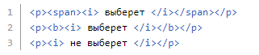

**Лабораторная работа №2**

1. Повторите страницу по образцу (при наведении курсора мыши на любой элемент списка, текущий элемент окрашивается в зеленый цвет, а элемент через один от него - в красный)

2. Повторите страницу по образцу (при наведении курсора мыши на любой элемент списка, текущий элемент окрашивается в зеленый цвет, а все элементы ниже кроме последнего - в красный)

Для следующих заданий нужно создать отдельный css файл, в котором перечислить все селекторы. Создавать соответствующий html-файл не обязательно, по желанию.

3. Сделайте селектор, который выберет все абзацы с классом **test** из дивов **
** с классом **hello**.

4. Сделайте селектор, который выберет все абзацы с классом **test** и одновременно все элементы с классом **hello**.

5. Сделайте селектор, который выберет все, что лежат непосредственно внутри и одновременно все с классом **test**.

6. Сделайте селектор, который выберет все, что лежат непосредственно после из элемента с **id=test**.

Пример HTML для проверки:

7. Дан следующий код:

Покрасьте в красный цвет только те теги b, которые являются непосредственными потомками тегов li.

8. Дан следующий код:

Покрасьте все h2 с классом header в красный цвет, а все h3 с этим классом - в синий.

9. Сделайте селектор, который выберет все абзацы идущие после из элемента с **id=test**.

10. Сделайте селектор, который выберет все, лежащие внутри любых элементов, лежащих внутри абзаца.

Пример HTML для проверки:

11. Сделайте селектор, который выберет все абзацы с атрибутом **title**, в значении которого есть слово **'привет'**.
