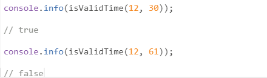
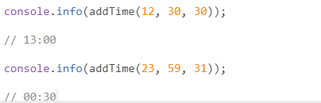

**Лабораторная работа №8**

**Задание 1. Сложить два числа**

В задании необходимо сложить два числа. 

Условия

- Функция в качестве аргументов может принимать как положительное или отрицательное число, так и строку, в которой содержится число (например, "12").
- Если переданная строка содержит не только цифры, то функция должна вернуть NaN. Например, нельзя сложить строку "12 бегемотов" и строку "38 попугаев".

**Задание 2. Проверка времени на корректность**

В задании необходимо проверить, что числа составляют корректное время.

Условия

- Гарантируется, что в функцию передаются два целых числа.
- Часы мы считаем правильными, если они находятся в диапазоне [0, 23].
- Минуты мы считаем правильными, если они находятся в диапазоне [0, 59]. Если часы и минуты правильные, то возвращаем 'true', иначе *—* 'false'.

**Задание 3. Добавление интервала ко времени**

В задании необходимо реализовать функцию, которая увеличивает время на заданное количество минут.

Условия

- На вход функция принимает 3 параметра: часы, минуты, интервал в минутах, на который нужно изменить время.
- Гарантируется, что любой из 3 параметров целое положительное число.
- Параметр часы принимает значение в диапазоне [0, 23].
- Параметр минуты принимает значение в диапазоне [0, 59].
- Прибавляемый интервал может быть больше 60 минут.
- Переход в следующие сутки должен корректно обрабатываться.
- Функция должна возвращать корректно отформатированное время: 1:2 –> 01:02

