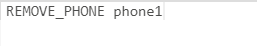

**Лабораторная работа №9**

**Задание 1. Список хештегов**

В этом задании необходимо вернуть список хештегов, которые содержатся в твите.

Условия

- Строка содержит только буквы русского и латинского алфавита, знак решетки и пробелы.
- Гарантируется, что в функцию передается непустая строка.
- Слова в строке разделены одним пробелом.
- Хештег начинается со знака решетки (#) и состоит из одного слова.
- В результирующем массиве хештеги должны быть без решетки.
- Если в слове хештегов нет, то возвращается пустой массив.

**Задание 2. Уникальный список хештегов**

В этом задании необходимо убрать повторения из списка хештегов и привести их к нижнему регистру. Результатом должна быть строка. Хештеги в строке должны быть разделены запятой и пробелом: `tag1, tag2, tag3`.

Условия

- Гарантируется, что массив содержит только хештеги.
- Массив может быть пустым. В этом случае должна вернуться пустая строка.
- Хештег *—* непустая строка, состоящая из одного слова.
- Повторяющиеся хештеги нужно игнорировать.
- При сравнении хештегов следует игнорировать регистр букв.
- Порядок хештегов из исходного массива должен сохраниться.

**Задание 3. Телефонная книга**

В этом задании необходимо реализовать функцию, через которую можно управлять телефонной книгой.

Для управления телефонной книгой нужно реализовать три команды:

- ADD *—* добавляет контакт
- REMOVE\_PHONE *—* удаляет номер
- SHOW *—* возвращает содержимое телефонной книги

Условия

- Гарантируется, что функция будет вызываться корректно, только со списком перечисленных команд. Корректность входных данных проверять не нужно.
- Имя команды пишется большими буквами, параметры разделяются одним пробелом.
- Гарантируется уникальность добавляемых телефонов.

**Команда ADD**

Добавляет контакт в телефонную книгу со списком телефонов. Телефоны перечисляются через запятую. Если такой контакт существует, то команда пополняет список телефонов контакта.

**Команда REMOVE\_PHONE**

Удаляет телефон из телефонной книги. Если телефон успешно удалён, то функция должна вернуть true. Если такого телефона в телефонной книге не существует, то возвращается false.

**Команда SHOW**

Возвращает массив контактов с их телефонами. Массив содержит строчки вида: "Имя: Телефон1, Телефон2". Массив должен быть отсортирован по имени контакта. Телефоны идут в порядке добавления их в телефонную книгу. Контакт с пустым списком телефонов не должен возвращаться.

